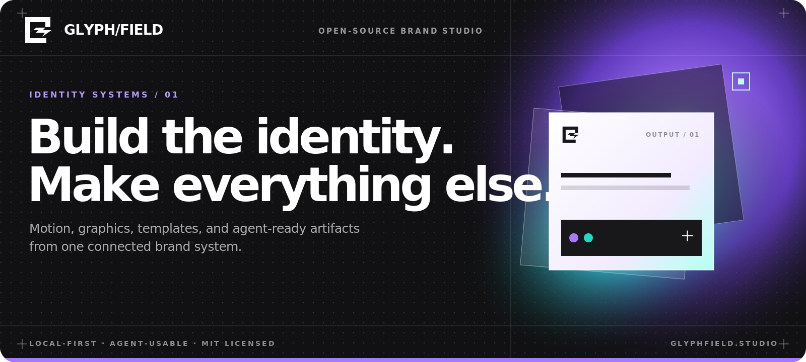
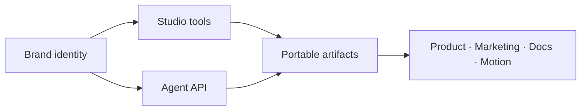

<p align="center">
  
</p>

<p align="center">
  A local-first studio for turning one brand identity into motion, graphics, templates, and agent-ready artifacts.
</p>

<p align="center">
  <a href="https://studio.generaltranslation.com/studio"><strong>Open Studio</strong></a>
  ·
  <a href="https://studio.generaltranslation.com/docs">Documentation</a>
  ·
  <a href="https://studio.generaltranslation.com/docs/agents/connect">Agent connection</a>
  ·
  <a href="./LICENSE">MIT License</a>
</p>

<p align="center">
  
  
  
  
</p>

## One identity, every surface

Glyphfield keeps the foundations and the outputs in the same system. Define a
brand once, then use the active identity across 15 focused tools and 66
production touchpoints without rebuilding the context for every artifact.

| Foundation | Expression | Application | Delivery |
| --- | --- | --- | --- |
| Logo family | Motion packages | OpenGraph + social | PNG |
| Color tokens | Live logo shaders | Slides + blog covers | SVG |
| Typography | Dither + grain + gradients | Email + product UI | GIF |
| Voice + positioning | Terminal themes | CLI + documentation | JSON |

The Studio ships with two creation systems—Starter and Template—plus complete
reference identities for General Translation, Ramp, Mintlify, Tailwind CSS,
Vite+, Cloudflare, and Stripe. Each reference connects a strategic idea to a
recognizable graphic device and a set of real applications. Project tabs are
independent local workspaces; closing a tab never deletes its brand.

## Strategy before styling

Every built-in identity records the challenge, central concept, promise,
pillars, personality, graphic device, composition rules, image direction, and
application system behind the output. Moodboards turn that source into ten
designed sections: strategy, logo architecture, color, typography, graphic
grammar, product, campaign, developer, editorial, and physical work.

The reference library is an implementation study, not a generic skin pack.
Ramp uses a savings ledger, Mintlify a knowledge beam, Tailwind a utility wave,
Vite+ a convergence field, Cloudflare a network horizon, and Stripe a
programmable field. General Translation remains black and white, organized by
one stable translation frame through which language moves.

## A design tool that agents can operate

The visual Studio and the public agent interface use the same identities,
catalog, and generation language.



- Humans compose, tune, preview, and download in `/studio`.
- Agents discover capabilities through `/llms.txt`, `/api/agent`, and
  `/openapi.json`.
- `POST /api/generate` produces deterministic SVG templates, backgrounds, and
  identity-aware element briefs.
- Browser projects and uploaded source files stay local; API generation is
  processed in memory and is not persisted.

## Motion studies

<table>
  <tr>
    <td width="50%"></td>
    <td width="50%"></td>
  </tr>
  <tr>
    <td align="center"><strong>Morph / fade</strong></td>
    <td align="center"><strong>Type / delete</strong></td>
  </tr>
</table>

Both are generated from the Studio’s reusable animation model: reorderable
text, logo, and image states; per-frame composition; configurable hold timing;
cubic-bezier transitions; animated solid, gradient, and shader backgrounds;
and frame-accurate GIF export.

## Built for real brand work

- Design boards combine foundations with finished applications and export up
  to 4800 × 6000 PNG.
- Logo Shader combines the supplied ShaderGradient sphere, ten original local
  GLSL recipes based on the visual families cataloged in Ariadne, and Studio materials across live
  backdrops and alpha-masked marks, with still PNG and animated GIF export.
- Background Lab creates gradients, grain, ordered Bayer dithering, dots,
  lines, and grids as portable SVG-composed images.
- Studio appearance persists light or dark mode, accent, canvas density, and a
  choice of Switzer, Be Vietnam Pro, Schibsted Grotesk, or Rethink Sans.
- Templates include fourteen slide layouts plus blog, partnership, OpenGraph,
  terminal, email, and brand-element systems.
- Fumadocs powers 24 feature, artifact, integration, and API guides.
- Landing, Studio, and every documentation page receive generated 1200 × 630
  OpenGraph and Twitter artwork from one shared brand renderer.

## Run locally

```bash
pnpm install
pnpm dev
```

Open [http://localhost:3012](http://localhost:3012). The full workspace is at
`/studio` and the documentation is at `/docs`.

```bash
pnpm typecheck
pnpm test
pnpm lint
pnpm build
```

## Generate without the UI

```bash
curl -sS -X POST http://localhost:3012/api/generate \
  -H 'Content-Type: application/json' \
  -d '{
    "kind": "template",
    "template": "slides",
    "identity": { "preset": "gt" },
    "slideLayout": "title",
    "title": "Code is the source of truth.",
    "output": "raw"
  }' \
  -o gt-slide.svg
```

The API embeds bundled logo assets into generated SVG. Custom agents can send
authorized images as base64 data URLs; Glyphfield never fetches remote asset
URLs.

| Resource | Purpose |
| --- | --- |
| [`/llms.txt`](./public/llms.txt) | Operational agent runbook |
| `/api/agent` | Versioned manifest and generation contract |
| `/openapi.json` | OpenAPI 3.1 document |
| `/api/catalog` | Structured Studio tool catalog |
| `/api/identities` | Nine built-in template and reference identities |
| `/api/elements` | Complete brand-element taxonomy |

## Project structure

```text
src/app/          Next.js pages, docs, metadata images, and public API
src/components/   Studio workspaces, canvases, motion, and shared UI
src/lib/          Identity model, renderers, generators, and catalogs
content/docs/     Fumadocs product and integration documentation
public/           Fonts, reference assets, examples, and agent instructions
```

Library decisions for syntax rendering, OpenGraph, gradients, and shaders are
recorded in [Studio library routing](./docs/library-routing.md).

## License

Glyphfield is open-source software released under the [MIT License](./LICENSE).
Bundled third-party marks and reference-brand assets remain the property of
their respective owners.

Official brand references and source assets are documented in
[Identities and custom assets](./content/docs/agents/identity-assets.mdx). Their
inclusion does not imply endorsement, and the MIT license does not grant rights
to third-party trademarks.
